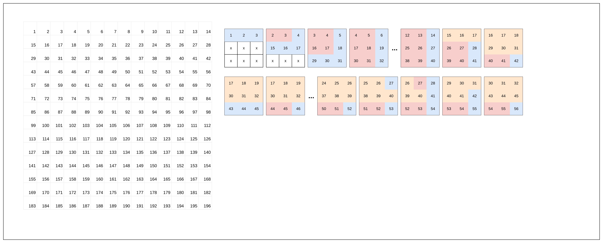

# CNN-BNN-Accelerator

## Introduction

This repo is mainly used for better documentation of my undergraduate thesis. If somehow you find this repo useful feel free to use it.

Other documentation also include
- [Presentation](https://www.canva.com/design/DAG07q-2XNc/1dfxVu5fiunu7GKDAHdBGQ/edit?utm_content=DAG07q-2XNc&utm_campaign=designshare&utm_medium=link2&utm_source=sharebutton)

## Prerequisite

If you are using the container make sure you have [nvidia toolkit](https://docs.nvidia.com/datacenter/cloud-native/container-toolkit/latest/install-guide.html).

## Running the docker

1. Building the docker

I'm naming my docker jupyter-brev

```bash
docker build -t jupyter-brev .
```

2. Starting the docker

```bash
bash ./start_contaiter.sh
```

3. starting new terminal

In a new console run:

``` bash
docker exec -it jupyter-brev
```

4. Stoping the container

to stop the container, just terminat where you started the conainer

<kbd>Ctrl</kbd> + <kbd>c</kbd> 


## Making new file

I prefer to store my file in the src and then mounting it in the docker, but you can also use the original workspace from the image.

## Running the jupyer notebook

There are two option:
1. Running in web by going to [localhost](http://127.0.0.1:8888/lab?token=12345123)

or

2. Using the kernel inside an opened vscode jupyter file


## RTL

The RTL code will be designed and verified using vivado from xilinx.

## PE convention

There are a control for 3x3 register which use**1**array signal ([8:0] control_signal), the convention to this as below:

Example
control_signal = 9'b101010000

| 0     | 0     | 0     |
| ----- | ----- | ----- |
| **0** | **1** | **0** |
| **1** | **0** | **1** |

## Dataflow

### IF configuration/FSM



From the picture above we have 12 states that is needed.
 We will enumerate it as

 1. Row 1

|     |     |     |
| --- | --- | --- |
| 1   | 1   | 1   |
| x   | x   | x   |
| x   | x   | x   |

 2. Row 2

|     |     |     |
| --- | --- | --- |
| 2   | 2   | 1   |
| 1   | 1   | 1   |
| x   | x   | x   |
 3. Row 3

|     |     |     |
| --- | --- | --- |
| 2   | 2   | 1   |
| 2   | 2   | 1   |
| 1   | 1   | 1   |

4. Side 1

|     |     |     |
| --- | --- | --- |
| 2   | 2   | 1   |
| 2   | 2   | 1   |
| 2   | 2   | 1   |


5. Side 2

|     |     |     |
| --- | --- | --- |
| 3   | 3   | 3   |
| 2   | 2   | 1   |
| 2   | 2   | 1   |

5. Side 3

|     |     |     |
| --- | --- | --- |
| 3   | 3   | 3   |
| 3   | 3   | 3   |
| 2   | 2   | 1   |


5. new row

|     |     |     |
| --- | --- | --- |
| 3   | 3   | 3   |
| 3   | 3   | 3   |
| 1   | 1   | 1   |

5. continue row

|     |     |     |
| --- | --- | --- |
| 3   | 3   | 3   |
| 3   | 3   | 3   |
| 2   | 2   | 1   |

5. finish row

|     |     |     |
| --- | --- | --- |
| 3   | 3   | 1   |
| 3   | 3   | 3   |
| 2   | 2   | 1   |


5. finish row

|     |     |     |
| --- | --- | --- |
| 3   | 2   | 1   |
| 3   | 3   | 1   |
| 2   | 2   | 1   |


5. finish row

|     |     |     |
| --- | --- | --- |
| 3   | 3   | 3   |
| 3   | 2   | 1   |
| 2   | 2   | 1   |